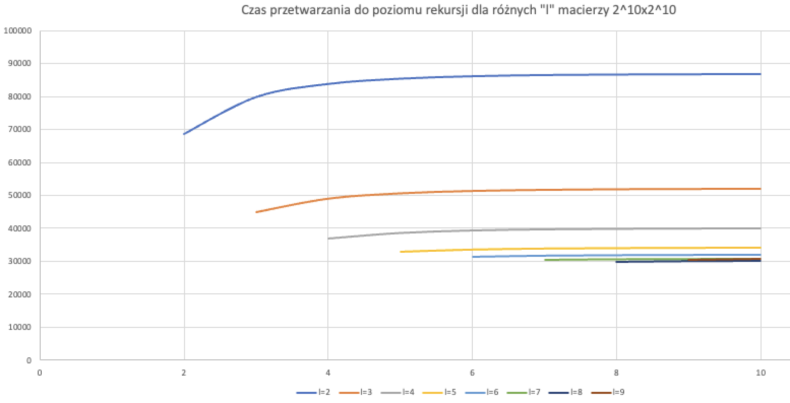

**Imię i nazwisko: Anastazja Jegorowa, Marcin Wardyński**

## Sprawozdanie do programu mnożenia macierzy

### Wariant programu:
Dla macierzy o rozmiarze mniejszym lub równym 2^l × 2^l algorytm tradycyjny.  
Dla macierzy o rozmiarze większym od 2^l × 2^l algorytm rekurencyjny Binéta.

Rozmiar macierzy: 10x10

#### 1. Pseudokod

```
    //tutaj pseudokod
```

#### 2. Wykres czasu przetwarzania w stosuknu do poziomu rekursji dla różnych "l"




#### 2. Wykres ilości operacji zmiennoprzecinkowych w stosuknu do poziomu rekursji dla różnych "l"

